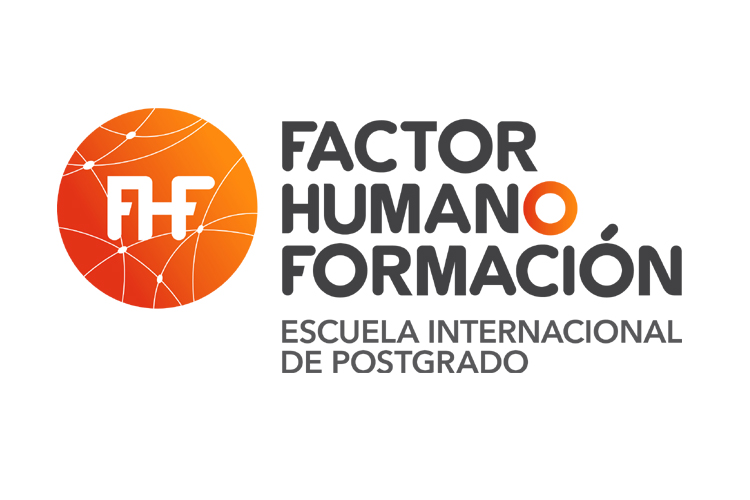
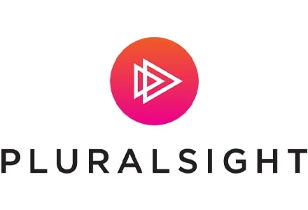
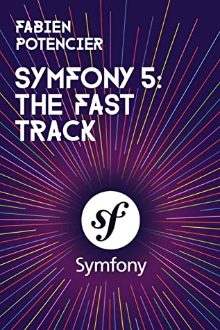
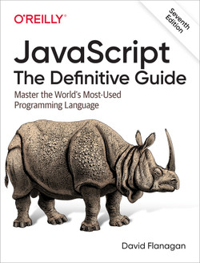

# Formación

Breve descripción de libros y formaciones interesantes que he estudiado durante mi carrera.

🌏 [**English**](FORMATION.md) ,
**Spanish**,
[**Galician**](FORMATION.gl.md)

 

## Cursos :eyeglasses:

|||||
|:---:|:---:|:---:|:---:|
|Preparación LPIC 1 & Administración Linux|Crea aplicaciones desde cero con Figma|Desarrollo web con Angular|Escribiendo contenidos con Markdown|
| | |||
||**Coming soon**|**Coming soon**| You can see it in this document or any of my **README** files|

 

## Libros :books:

|||||
|:---:|:---:|:---:|:---:|
|Symfony 5: The Fast Track|O'Reilly JS The definitive guide 2021||||
|||||
|[Demo app](https://github.com/DevFranPR/symfony-tft-guestbook)||||

 

---