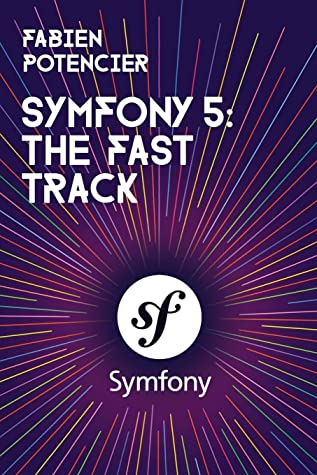

# Formation

Brief description of interesting books and training that I have been studying throughout my career.

🌏 **English** ,
[**Spanish**](FORMATION.es.md),
[**Galician**](FORMATION.gl.md)

 

## Courses :eyeglasses:

|||||
|:---:|:---:|:---:|:---:|
|LPIC 1 Preparation & Linux Administration|Build aplications from scratch with Figma|Angular web development|Writing Content With Markdown|
| | |||
||**Coming soon**|**Coming soon**| You can see it in this document or any of my **README** files|

 

## Books :books:

|||||
|:---:|:---:|:---:|:---:|
|Symfony 5: The Fast Track|O'Reilly JS The definitive guide 2021||||
|||||
|[Demo app](https://github.com/DevFranPR/symfony-tft-guestbook)||||

 

---