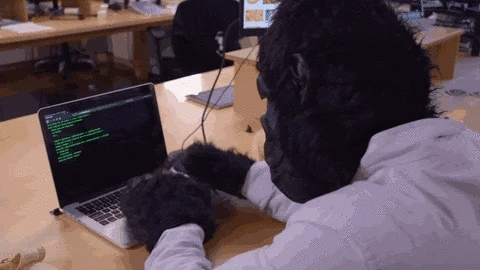

# Profile :page_facing_up:

```js
const profile = {
    name: "Fran",
    years: 0b00011100,
    os: "Debian",
    type: "backend",
    country: "Spain",
    locales:["es_utf8","gl_utf8","en_utf8"],
    timezone: "Europe/Madrid"
}
```


## Languages :keyboard:
---
<br>

<!--Badges by https://github.com/Ileriayo/markdown-badges -->
<p align="center">


</p>


## Technologies / skills :hammer_and_wrench:
---
<br>


## Working :fire: 
---

Currently working on projects to show my skills in public repos. I'm shy, so maybe the projects will not be ready for a while, but in the long run they will start to pop up in my GitHub profile.

<br>

<p align="center">
    
</p>

<br>

## Learning :eyeglasses:
---

Now I'm interested in laying the groundwork with the languages that I already know. My main goal is to develop software: safe, stable and follow good practices and continuous delivery. I would like to improve in my craft enough to start practicing other languages, frameworks and technologies that call my attention.

<figure align="center">
    
    <figcaption><strong>POV: You caught me offgard studying</strong></figcaption>
</figure>

<center>

| Field | Interest | 
|:---:|:---:|
| Frontend | Angular, React, Animation frameworks |
| Backend | Symfony, Express, Node |
| Mobile | Kotlin, Flutter, React Native |
| Databases | PostgreSQL, MongoDB |
| Testing | JUnit, Jester |
| Version Control | GitHub Actions |
| Server side | Monitoring, hardening & securing |
| Videogames | Godot Engine |
| Other Languages | Python, C++, Go, Rust | 

</center>

<br>

## I'm looking for help with :raised_hand:
---
<br>

<p align="center">
    
</p>

**I'm still a newbie, so all the help I could get in future repos are welcome. Always with respect and good manners pls** 👏.

---
<br>


## Contact me in :inbox_tray:
---
<br>

[](mailto:devfranpr@gmail.com)
[](https://www.linkedin.com/in/francisco-peteira-rodriguez/)

</p>

<br>

---
---
---